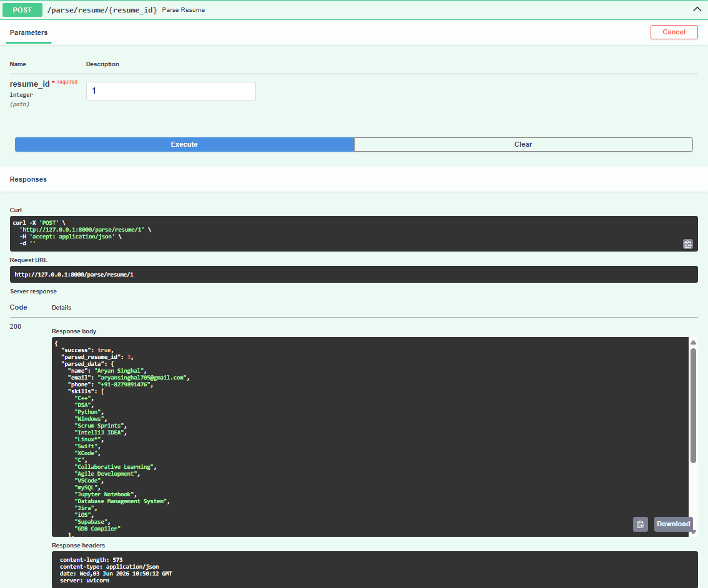

# 📄 Resume Analyzer (FastAPI)

Resume Analyzer is a FastAPI-based backend application designed to streamline resume processing and job description analysis. The project currently supports user authentication, resume uploads, resume parsing, and job description submission through REST APIs.

---

## 📸 Project Preview



---

## 🚀 Features (Current Stage - Step 5)

### 🔐 Authentication

* User Registration
* User Login
* JWT Token-Based Authentication

### 📄 Resume Management

* Resume Upload API
* Resume Parsing API
* Retrieve Parsed Resume Data

### 📝 Job Description Processing

* Submit Job Descriptions (JD)
* Store and Process JD Data

### 📚 API Documentation

* Interactive Swagger UI (`/docs`)
* Easy API Testing and Validation

---

## 🛠️ Tech Stack

* Python 3.x
* FastAPI
* Uvicorn
* Pydantic
* JWT Authentication
* SQL Database *(depending on project configuration)*

---

## 📂 Project Structure

```bash
project/
│
├── app/
│   ├── main.py
│   ├── routers/
│   ├── models/
│   ├── schemas/
│   ├── services/
│   └── utils/
│
├── resume_parsing.png
├── requirements.txt
└── README.md
```

---

## 📦 Installation & Setup

### 1️⃣ Clone the Repository

```bash
git clone <your-repository-url>
cd <project-folder>
```

---

### 2️⃣ Create Virtual Environment

```bash
python -m venv venv
```

#### Activate Environment

**Windows**

```bash
venv\Scripts\activate
```

**Mac/Linux**

```bash
source venv/bin/activate
```

---

### 3️⃣ Install Dependencies

```bash
pip install -r requirements.txt
```

---

### 4️⃣ Verify Project Setup

Run the main file:

```bash
python main.py
```

Expected output:

```bash
Process finished with exit code 0
```

---

### 5️⃣ Start FastAPI Server

```bash
uvicorn app.main:app --reload
```

Server will start at:

```text
http://127.0.0.1:8000
```

---

### 6️⃣ Access Swagger Documentation

Open:

```text
http://127.0.0.1:8000/docs
```

Swagger UI provides an interactive interface for testing all APIs.

---

## 🔐 Authentication Workflow

### Step 1: Register User

Use:

```http
POST /register
```

Create a new user account.

---

### Step 2: Login User

Use:

```http
POST /login
```

Login and obtain an access token.

---

### Step 3: Authorize API Requests

1. Click the **🔒 Authorize** button in Swagger UI.
2. Paste the generated access token.

Example:

```text
your_access_token_here
```

> ⚠️ Do not add quotation marks (" ") around the token.

3. Click **Authorize**.

---

## 📤 Resume Processing Workflow

### Upload Resume

```http
POST /upload_resume
```

Uploads a resume file to the system.

---

### Parse Resume

```http
POST /post_parsing
```

Processes and extracts information from the uploaded resume.

---

### Retrieve Parsed Data

```http
GET /get_parsing
```

Returns the parsed resume information.

---

## 📄 Job Description Workflow

### Submit Job Description

```http
POST /post_jd
```

Uploads and processes a Job Description (JD) for future matching and analysis.

---

## 📌 API Endpoints Overview

| Endpoint         | Method | Description                 |
| ---------------- | ------ | --------------------------- |
| `/register`      | POST   | Register User               |
| `/login`         | POST   | User Login                  |
| `/upload_resume` | POST   | Upload Resume               |
| `/post_parsing`  | POST   | Parse Resume                |
| `/get_parsing`   | GET    | Retrieve Parsed Resume Data |
| `/post_jd`       | POST   | Submit Job Description      |

---

## ⚠️ Important Notes

* This is an ongoing development project.
* Current implementation covers **Steps 1–5**.
* JWT authentication is required for protected routes.
* Additional features will be introduced in future phases.

---

## 🚀 Upcoming Features

* AI-Based Resume Matching
* Resume Scoring Engine
* Candidate Ranking System
* Skill Gap Analysis
* Advanced Job Recommendation System
* Analytics Dashboard

---

## 📈 Project Status

| Phase               | Status         |
| ------------------- | -------------- |
| Step 1              | ✅ Completed    |
| Step 2              | ✅ Completed    |
| Step 3              | ✅ Completed    |
| Step 4              | ✅ Completed    |
| Step 5              | ✅ Completed    |
| Future Enhancements | 🚧 In Progress |

---

## 🧑‍💻 Author

**Resume Analyzer Project**
FastAPI-Based Resume Analysis & Job Matching System
